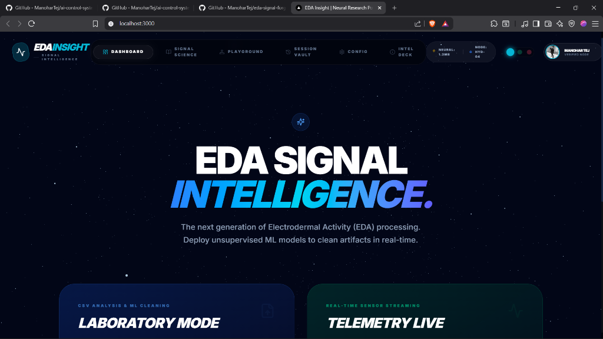
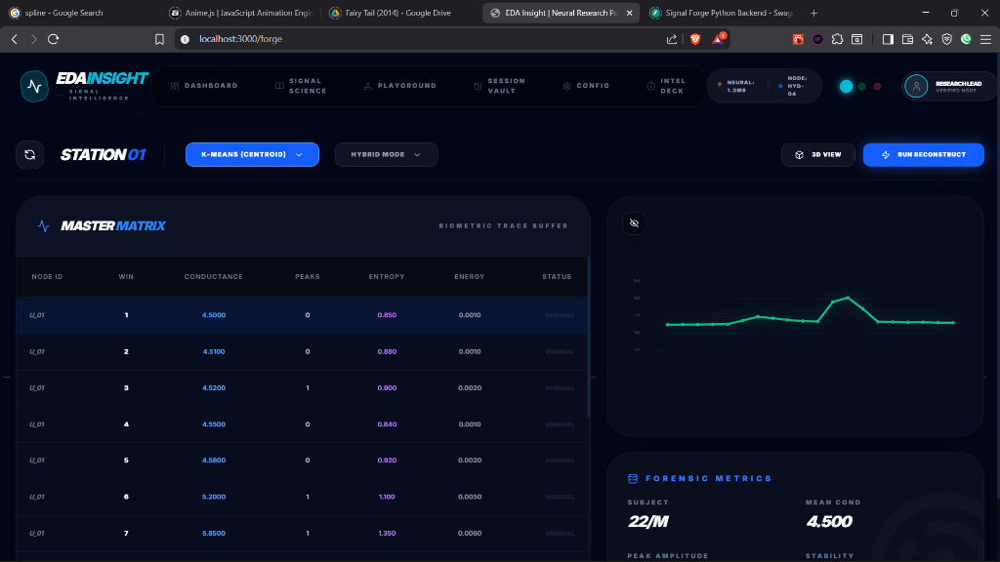
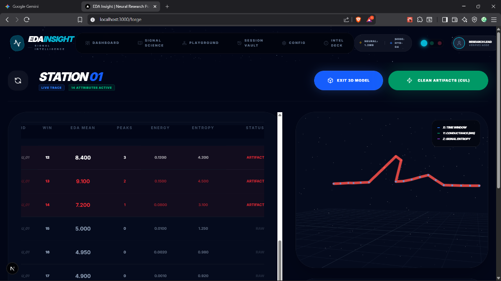
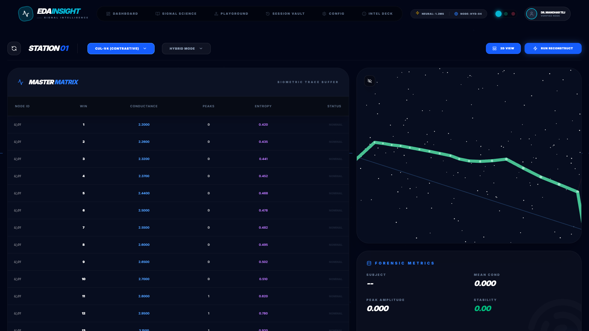
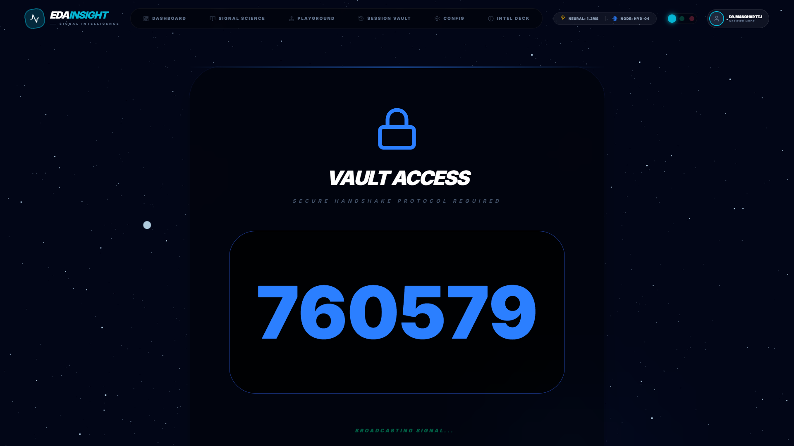
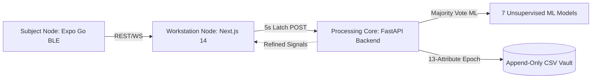

# 🧬 SIGNAL FORGE: Forensic Biometric Workstation

[](https://github.com/)
[](https://github.com/)
[](https://nextjs.org/)
[](https://fastapi.tiangolo.com/)
[](https://expo.dev/)

Signal Forge is a state-of-the-art computational ecosystem designed to decode human autonomic arousal responses through high-frequency Electrodermal Activity (EDA/GSR) signals. The platform addresses the **"Noise-to-Signal Paradox"** in biometrics — resolving fragile skin conductance traces corrupted by mechanical motion, sensor drift, and pressure anomalies through a dual-cranial architecture.

By separating visuals from heavy-duty vector operations, Signal Forge coordinates edge data ingestion (mobile node), streaming visualization (workstation node), and high-performance unsupervised neural cleaning (processing node).

---

## 🎨 System Walkthrough (Screenshots)

### 1. Central Workstation Gateway
A clinical, glassmorphic landing page styled with responsive HSL glow-trails and 3D GSAP mouse-tilt physics. Allows researchers to toggle between live WebSocket streams and batch CSV uploads.



### 2. Forensic ML Laboratory (Dashboard)
The core signal playground. Upload high-frequency CSV traces and select from a suite of 7 unsupervised machine learning models to identify and heal motion artifacts in real-time.

* **2D Reconstruction Mode (Tuning Algorithms)**:


* **3D Biosensor Cloud Mode (Reconstructed Trace)**:


### 3. WebGL 3D Biosensor Cloud (Results)
Plots high-density multi-attribute bio-signals in an interactive 3D WebGL scatter space using React Three Fiber, rendering signal baseline (SCL) and phasic spikes (SCR) in real-time.



### 4. Telemetry Live Ingestion (Features)
Streams live sensor data at 500Hz via secure WebSockets. Features real-time SCL/SCR peak analysis, entropy calculation, and instant artifact detection overlay.



---

## 🧩 Key Architecture

Signal Forge is built on a **Decentralized Multi-Node Topology** ensuring edge telemetry remains lightweight while heavy-duty cleaning is run on stateless processing cores.



For a deep-dive analysis of technical decisions, database designs, and equations, read the [Project Analysis Document](./docs/PROJECT_ANALYSIS.md).

---

## 🚀 Key Features

*   **7-Algorithm Unsupervised Sandbox:** Compare individual or hybrid configurations of CUL-v4 (Contrastive Unsupervised Learning), Gaussian Mixture Models (GMM), KMeans, DBSCAN, Isolation Forest, Local Outlier Factor (LOF), and Principal Component Analysis (PCA).
*   **Ensemble Consensus Healing:** Employs majority-vote models to flag artifacts. Restores missing sections using piece-wise linear bridges to prevent artificial flatlines.
*   **Shannon Entropy Stability Index:** Evaluates signal chaos ($H(x) = -\sum p(x_i) \log p(x_i)$) to select and suggest the most stable reconstruction.
*   **Temporal CSV Vault:** An append-only persistence layer capturing a detailed 13-attribute matrix every 5-second epoch, preventing transaction locks during high-frequency telemetry logging.
*   **Interactive 3D HUD:** Visualize biometric clouds in real-time using a custom React Three Fiber interface with OrbitControls and presentation rigs.

---

## 💻 Tech Stack

*   **Frontend:** Next.js 14, Tailwind CSS, GSAP 3D Physics, Framer Motion, Chart.js, React Three Fiber.
*   **Backend:** FastAPI (Python), Uvicorn, NumPy, SciPy, scikit-learn, Pandas.
*   **Mobile:** Expo, React Native, Haptic Engine, SVG.
*   **Database:** Append-Only CSV Stream + Flat-File JSON PII Passport.

---

## 🛠️ Installation &amp; Setup

To run the complete Signal Forge Workstation locally:

### 1. Start the Neural Processing Core (Backend)
Navigate to the backend directory, install python dependencies, and launch the ASGI server:
```bash
# Navigate to backend
cd python_backend

# Install dependencies
pip install -r requirements.txt

# Run server
python main.py
```
The backend will boot on `http://127.0.0.1:8000`.

### 2. Launch the Analytics Dashboard (Frontend)
Navigate to the web app directory, install node packages, and run the developer server:
```bash
# Navigate to web app
cd eda-insight

# Install dependencies
npm install --legacy-peer-deps

# Start dev server
npm run dev
```
Open `http://localhost:3000` in your browser. Add `?mock_auth=true` to bypass credentials and log in automatically as `Manohar Tej`.

### 3. Boot the Subject Terminal (Mobile app)
Requires Expo Go to run the edge simulator or connect physical electrodes:
```bash
# Navigate to mobile app
cd subject-mobile

# Install packages
npm install

# Launch Expo
npx expo start
```

---

## 📡 Autonic Telemetry Live Ingestion

The telemetry sub-system is built for raw high-frequency data streaming. 
- **WebSocket Streaming Core**: Ingests real-time micro-siemens (μS) sensor feeds over low-latency WebSockets.
- **Tonic/Phasic Waveform Separation**: Splits SCL (slow-moving baseline skin conductance) from SCR (fast sympathetic arousal bursts) using a vectorized rolling low-pass filter.
- **Live Haptic Feedback**: Transmits tactile connection locks and connection-lost alerts back to the edge client using the Expo Haptics API.

---

## 📄 Forensic Report PDF Synthesis

The workstation includes an automated reporting engine powered by `jsPDF` and `html2canvas` to deliver publication-grade research logs:
- **Dual Trace Rendering**: Embeds both raw (unfiltered) and refined (cleaned) traces side-by-side to demonstrate artifact suppression performance.
- **Auditor Verdict Section**: Incorporates the final Stability Index and Smoothness Scores computed by the backend.
- **Relational Integrity**: Automatically stamps the output document with the anonymized `User_ID` and chronological timestamp metadata.

---

## 📂 Repository Structure

*   [`eda-insight/`](./eda-insight/) - The Next.js dashboard workstation. Contains WebGL 3D views, GSAP card setups, and report generation routines.
*   [`python_backend/`](./python_backend/) - The FastAPI server housing the scikit-learn suites, telemetry DB logger, and the Shannon Entropy scoring algorithm.
*   [`subject-mobile/`](./subject-mobile/) - React Native Expo client managing capacitive pressure edge sensing.
*   [`docs/`](./docs/) - Architecture source files, diagram layouts, and PROJECT_ANALYSIS.
*   [`screenshots/`](./screenshots/) - High-resolution captures of the workstation screens.

---

## 🧪 Future Improvements

1.  **Distributed Edge Workers:** Move lightweight unsupervised models (like KMeans or simple threshold CUL) directly into Expo using WebAssembly/TensorFlow.js to perform pre-filtering on-device.
2.  **SQL Database Gateway:** Implement an optional Postgres migration for high-throughput institutional studies, preserving CSV output for isolated field stations.
3.  **Real-Time BLE Protocols:** Replace WebSocket polling with direct Bluetooth Low Energy Web-API links inside the browser for true zero-latency client connections.
